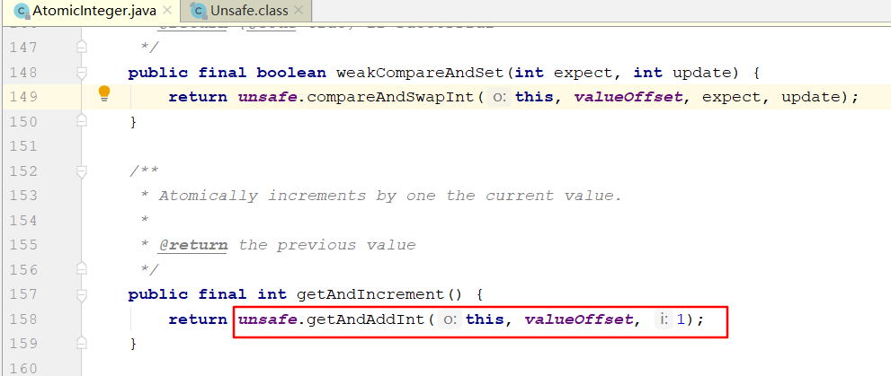
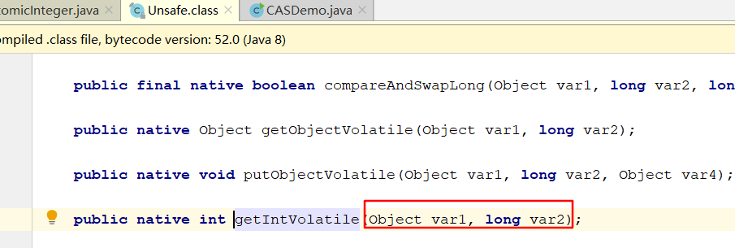
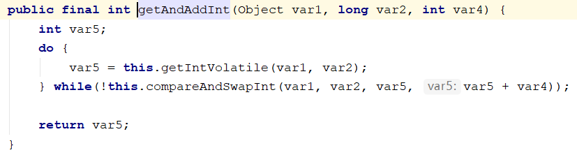

# CAS

## CAS是什么

- 比较并交换，比较当前工作内存中的值和主内存中的值，如果相同则执行规定操作，否则继续比较直到 主内存和工作内存中的值一致为止。

```java
public class CASDemo {
    public static void main(String[] args) {
        AtomicInteger atomicInteger = new AtomicInteger(5);
        System.out.println(atomicInteger.compareAndSet(5, 2019)+"\t current"+atomicInteger.get());
        System.out.println(atomicInteger.compareAndSet(5, 2014)+"\t current"+atomicInteger.get());
    }
}
```

- CAS的全称为Compare-And-Swap ，它是一条CPU并发原语。

  它的功能是判断内存某个位置的值是否为预期值，如果是则更新为新的值，这个过程是原子的。

- CAS并发原语提现在Java语言中就是sun.miscUnSaffe类中的各个方法。调用UnSafe类中的CAS方法，JVM会帮我实现CAS汇编指令。这是一种完全依赖于硬件 功能，通过它实现了原子操作，再次强调，由于CAS是一种系统原语，原语属于操作系统用于范畴，是由若干条指令组成，用于完成某个功能的一个过程，并且原语的执行必须是连续的，在执行过程中不允许中断，也即是说CAS是一条原子指令，不会造成所谓的数据不一致的问题。

  

  

  ```
  var1 AtomicInteger对象本身.
  var2 该对象值的引用地址
  var4 需要变动的数值
  var5 是用过var1 var2找出内存中绅士的值
  用该对象当前的值与var5比较
  如果相同,更新var5的值并且返回true
  如果不同,继续取值然后比较,直到更新完成
  ```

  

  ```
  假设线程A和线程B两个线程同时执行getAndAddInt操作(分别在不同的CPU上):
   
  1.AtomicInteger里面的value原始值为3,即主内存中AtomicInteger的value为3,根据JMM模型,线程A和线程B各自持有一份值为3的value的副本分别到各自的工作内存.
   
  2.线程A通过getIntVolatile(var1,var2) 拿到value值3,这是线程A被挂起.
   
  3.线程B也通过getIntVolatile(var1,var2) 拿到value值3,此时刚好线程B没有被挂起并执行compareAndSwapInt方法比较内存中的值也是3 成功修改内存的值为4 线程B打完收工 一切OK.
   
   4.这是线程A恢复,执行compareAndSwapInt方法比较,发现自己手里的数值和内存中的数字4不一致,说明该值已经被其他线程抢先一步修改了,那A线程修改失败,只能重新来一遍了.
   
   5.线程A重新获取value值,因为变量value是volatile修饰,所以其他线程对他的修改,线程A总是能够看到,线程A继续执行compareAndSwapInt方法进行比较替换,直到成功.
  ```

## CAS底层原理

### Unsafe

- 是CAS的核心类，由于Java 方法无法直接访问底层，需要通过本地(native)方法来访问，UnSafe相当于一个后门，基于该类可以直接操作特定内存的数据。UnSafe类在sun.misc包中，其内部方法操作可以向C的指针一样直接操作内存，因为Java中CAS操作的执行依赖于UnSafe类的方法。
  注意UnSafe类中所有的方法都是native修饰的，也就是说UnSafe类中的方法都是直接调用操作底层资源执行响应的任务。
- 变量ValueOffset，便是该变量在内存中的偏移地址，因为UnSafe就是根据内存偏移地址获取数据的。
- 变量value和volatile修饰，保证了多线程之间的可见性。

## CAS缺点

- 循环时间长开销很大

- 只能保证一个共享变量的原子性

- ABA问题

  - CAS算法实现一个重要前提需要取出内存中某时刻的数据并在当下时刻比较并替换，那么这个时间差内会导致数据的变化。

    比如说一个线程one从内存位置V中取出A，这时候另一个线程two也从内存中取出A，并且two进行了一些操作将值编程了B，然后线程two又将V位置的数据变成A，这时候线程one进行CAS操作，发现内存中仍然是A，然后线程one操作成功。尽管线程one的CAS操作成功，但是不代表这个过程就是没有问题的。