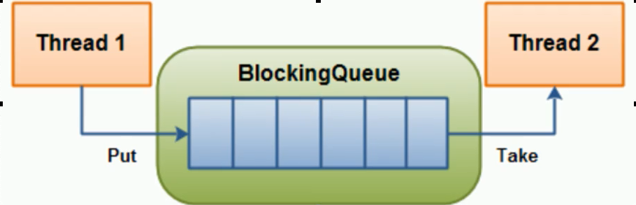
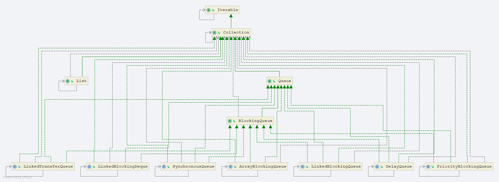

# 阻塞队列

## 简介

阻塞队列,顾名思义,首先它是一个队列,而一个阻塞队列在数据结构中所起的作用大致如图所示:



- 线程1往阻塞队列中添加元素二线程2从队列中移除元素

- 当阻塞队列是空时，从队列中获取元素的操作将会被阻塞。

- 当阻塞队列是满时，往队列中添加元素的操作将会被阻塞。

- 试图往已满的阻塞队列中添加新元素的线程同样也会被阻塞，直到其他线程从队列中移除一个或者多个元素或者全清空队列后使队列重新变得空闲起来并后续新增

在多线程领域：所谓阻塞，在某些情况下会挂起线程(即线程阻塞)，一旦条件满足，被挂起的线程优惠被自动唤醒。

## 为什么需要使用BlockingQueue

- 好处是我们不需要关心什么时候需要阻塞线程，什么时候需要唤醒线程,因为BlockingQueue都一手给你包办好了。

- 在concurrent包 发布以前，在多线程环境下，我们每个程序员都必须自己去控制这些细节，尤其还要兼顾效率和线程安全，而这会给我们的程序带来不小的复杂度。

- 核心方法

| 方法类型 | 抛出异常 | 特殊值 | 阻塞 | 超时 |
| :-------- | :--------- | :-------- | :------ | :------------------ |
| 插入     | add(e)    | offer(e) | put(e) | offer(e,time,unit) |
| 移除     | remove()  | poll()   | take() | poll(time,unit)    |
| 检查     | element() | peek()   | 不可用 | 不可用             |

| 类型 | 解释 |
| :-------- | :--------- |
| 抛出异常 | 当阻塞队列满时,再往队列里面add插入元素会抛IllegalStateException: Queue full当阻塞队列空时,再往队列Remove元素时候回抛出NoSuchElementException |
| 特殊值   | 插入方法,成功返回true 失败返回false移除方法,成功返回元素,队列里面没有就返回null |
| 一直阻塞 | 当阻塞队列满时,生产者继续往队列里面put元素,队列会一直阻塞直到put数据or响应中断退出当阻塞队列空时,消费者试图从队列take元素,队列会一直阻塞消费者线程直到队列可用. |
| 超时退出 | 当阻塞队列满时,队列会阻塞生产者线程一定时间,超过后限时后生产者线程就会退出 |

## 阻塞队列架构



- ArrayBlockingQueue： 由数组结构组成的有界阻塞队列.

- LinkedBlockingDeque：由链表结构组成的有界(但大小默认值Integer>MAX_VALUE)阻塞队列.
- PriorityBlockingQueue：支持优先级排序的无界阻塞队列.
- DelayQueue： 使用优先级队列实现的延迟无界阻塞队列.
- SynchronousQueue：不存储元素的阻塞队列,也即是单个元素的队列.
- LinkedTransferQueue：由链表结构组成的无界阻塞队列.
- LinkedBlockingDeque：由链表结构组成的双向阻塞队列.

## 怎么使用

### 生产者消费者模式

#### 传统版

```java
/**
 * 共享资源类
 */
class ShareData {
    private int num = 0;
    private Lock lock = new ReentrantLock();
    private Condition condition = lock.newCondition();

    public void increment() throws Exception {
        lock.lock();
        try {
            //判断
            while (num != 0) {
                //等待 不生产
                condition.await();
            }
            //干活
            num++;
            System.out.println(Thread.currentThread().getName() + "\t" + num);
            //通知唤醒
            condition.signalAll();
        } finally {
            lock.unlock();
        }
    }

    public void deIncrement() throws Exception {
        lock.lock();
        try {
            //判断
            while (num == 0) {
                //等待 不生产
                condition.await();
            }
            //干活
            num--;
            System.out.println(Thread.currentThread().getName() + "\t" + num);
            //通知唤醒
            condition.signalAll();
        } finally {
            lock.unlock();
        }
    }
}

/**
 * Description
 * 一个初始值为0的变量 两个线程交替操作 一个加1 一个减1来5轮
 *
 * @author veliger@163.com
 * @version 1.0
 * @date 2019-04-13 14:01
 **/
public class ProdConsumerTraditionDemo {
    public static void main(String[] args) {
        ShareData shareData = new ShareData();
        new Thread(() -> {
            for (int i = 1; i <= 5; i++) {
                try {
                    shareData.increment();
                } catch (Exception e) {
                    e.printStackTrace();
                }
            }
        }, "AA").start();
        new Thread(() -> {
            for (int i = 1; i <= 5; i++) {
                try {
                    shareData.deIncrement();
                } catch (Exception e) {
                    e.printStackTrace();
                }
            }
        }, "BB").start();
    }
}
```


#### 阻塞队列版

```java
class MyResource {
    /**
     * 默认开启 进行生产消费的交互
     */
    private volatile boolean flag = true;
    /**
     * 默认值是0
     */
    private AtomicInteger atomicInteger = new AtomicInteger();

    private BlockingQueue<String> blockingQueue = null;

    public MyResource(BlockingQueue<String> blockingQueue) {
        this.blockingQueue = blockingQueue;
        System.out.println(blockingQueue.getClass().getName());
    }

    public void myProd() throws Exception {
        String data = null;
        boolean returnValue;
        while (flag) {
            data = atomicInteger.incrementAndGet() + "";
            returnValue = blockingQueue.offer(data, 2L, TimeUnit.SECONDS);
            if (returnValue) {
                System.out.println(Thread.currentThread().getName() + "\t 插入队列数据" + data + "成功");
            } else {
                System.out.println(Thread.currentThread().getName() + "\t 插入队列数据" + data + "失败");
            }
            TimeUnit.SECONDS.sleep(1);
        }
        System.out.println(Thread.currentThread().getName() + "\t 停止 表示 flag" + flag);
    }

    public void myConsumer() throws Exception {
        String result = null;
        while (flag) {
            result = blockingQueue.poll(2L, TimeUnit.SECONDS);
            if(null==result||"".equalsIgnoreCase(result)){
                flag=false;
                System.out.println(Thread.currentThread().getName()+"\t"+"超过2m没有取到 消费退出");
                System.out.println();
                System.out.println();
                return;
            }
            System.out.println(Thread.currentThread().getName() + "消费队列" + result + "成功");

        }
    }
    public void stop() throws Exception{
        flag=false;
    }
}

/**
 * Description
 * volatile/CAS/atomicInteger/BlockQueue/线程交互/原子引用
 *
 * @author veliger@163.com
 * @version 1.0
 * @date 2019-04-13 14:02
 **/
public class ProdConsumerBlockQueueDemo {
    public static void main(String[] args) throws Exception {
        MyResource myResource = new MyResource(new ArrayBlockingQueue<>(10));
        new Thread(()->{
            System.out.println(Thread.currentThread().getName()+"\t生产线程启动");
            try {
                myResource.myProd();
            } catch (Exception e) {
                e.printStackTrace();
            }
        },"Prod").start();

        new Thread(()->{
            System.out.println(Thread.currentThread().getName()+"\t消费线程启动");
            try {
                myResource.myConsumer();
            } catch (Exception e) {
                e.printStackTrace();
            }
        },"consumer").start();
        try { TimeUnit.SECONDS.sleep(5); } catch (InterruptedException e) { e.printStackTrace(); }
        System.out.println();
        System.out.println();
        System.out.println();
        System.out.println("时间到,停止活动");
        myResource.stop();
    }
}
```


### 线程池

### 消息中间件