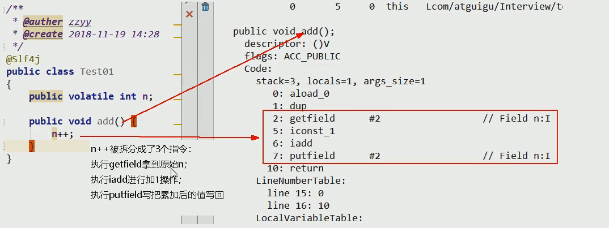

# Volatile

## Volatile是Java虚拟机提供的轻量级的同步机制

- 保证可见性
- 不保证原子性
- 禁止指令重排

## JMM

*JMM(Java内存模型Java Memory Model,简称JMM)*本身是一种抽象的概念 并不真实存在，它描述的是一组规则或规范通过规范定制了程序中各个变量(包括实例字段,静态字段和构成数组对象的元素)的访问方式。
JMM关于同步规定:

- 线程解锁前，必须把共享变量的值刷新回主内存
- 线程加锁前，必须读取主内存的最新值到自己的工作内存
- 加锁解锁是同一把锁

由于JVM运行程序的实体是线程，而每个线程创建时JVM都会为其创建一个工作内存(有些地方成为栈空间)，工作内存是每个线程的私有数据区域，而Java内存模型中规定所有变量都存储在主内存，主内存是共享内存区域，所有线程都可访问，但线程对变量的操作(读取赋值等)必须在工作内存中进行，首先要将变量从主内存拷贝到自己的工作空间，然后对变量进行操作，操作完成再将变量写回主内存，不能直接操作主内存中的变量，各个线程中的工作内存储存着主内存中的变量副本拷贝，因此不同的线程无法访问对方的工作内存，此案成间的通讯(传值) 必须通过主内存来完成,其简要访问过程。


- 可见性

  通过前面对JMM的介绍，我们知道。各个线程对主内存中共享变量的操作都是各个线程各自拷贝到自己的工作内存操作后再写回主内存中的。
  这就可能存在一个线程AAA修改了共享变量X的值还未写回主内存中时 ，另外一个线程BBB又对内存中的一个共享变量X进行操作，但此时A线程工作内存中的共享比那里X对线程B来说并不不可见。这种工作内存与主内存同步延迟现象就造成了可见性问题。

- 原子性

  多线程线程不安全的原因

  

- 有序性

  计算机在执行程序时，为了提高性能，编译器和处理器常常会做指令重排，一把分为以下3种：

  源代码 --> 编译器优化的重排 --> 指令并行的重排 --> 内存系统的重排 --> 最终执行的指令

## Volatile的使用

- 单例模式DCL

  ```java
  public class SingletonDemo {
  
      private static volatile SingletonDemo instance=null;
      
      private SingletonDemo(){
          System.out.println(Thread.currentThread().getName()+"\t 构造方法");
      }
  
      /**
       * 双重检测机制
       * @return
       */
      public static SingletonDemo getInstance(){
          if(instance==null){
              synchronized (SingletonDemo.class){
                  if(instance==null){
                      instance=new SingletonDemo();
                  }
              }
          }
          return instance;
      }
  
      public static void main(String[] args) {
          for (int i = 1; i <=10; i++) {
              new Thread(() ->{
                  SingletonDemo.getInstance();
              },String.valueOf(i)).start();
          }
      }
  }
  
  ```

  

- 代理模式

  DCL(双端检锁) 机制不一定线程安全，原因是有指令重排的存在，加入volatile可以禁止指令重排
  
  原因在于某一个线程在执行到第一次检测，读取到的instance不为null时，instance的引用对象可能没有完成初始化.

  instance=new SingletonDem(); 可以分为以下步骤(伪代码)
  
  memory=allocate();//1.分配对象内存空间

  instance(memory);//2.初始化对象
  
  instance=memory;//3.设置instance的指向刚分配的内存地址,此时instance!=null 
  
  步骤2和步骤3不存在数据依赖关系。而且无论重排前还是重排后程序执行的结果在单线程中并没有改变，因此这种重排优化是允许的。
  
  memory=allocate();//1.分配对象内存空间
  
  instance=memory;//3.设置instance的指向刚分配的内存地址,此时instance!=null 但对象还没有初始化完.
  
  instance(memory);//2.初始化对象
  
  但是指令重排只会保证串行语义的执行一致性(单线程) 并不会关心多线程间的语义一致性
  
  所以当一条线程访问instance不为null时，由于instance实例未必完成初始化,也就造成了线程安全问题。

